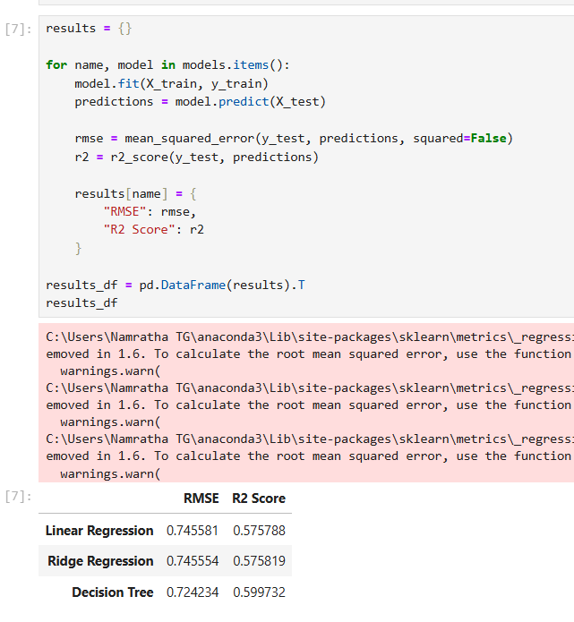
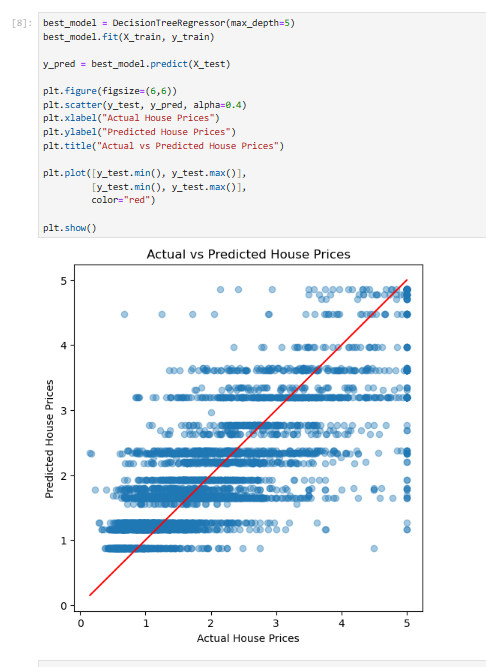

# 🏠 House Price Prediction – AI/ML Task 2

## 📌 Project Overview

This project focuses on Feature Engineering, Model Optimization, and Performance Comparison using the California Housing dataset.

The objective of this project is to:
- Apply feature scaling
- Train multiple regression models
- Compare model performance using evaluation metrics
- Select the best-performing model

This project follows a structured Machine Learning workflow similar to real-world industry practices.

## 📊 Dataset Information

- Dataset: California Housing Dataset (from scikit-learn)
- Problem Type: Regression
- Target Variable: Median House Value (HousePrice)

### Features Used:
- Median Income (MedInc)
- House Age (HouseAge)
- Average Rooms (AveRooms)
- Average Bedrooms (AveBedrms)
- Population
- Average Occupancy (AveOccup)
- Latitude
- Longitude

## ⚙️ Project Workflow

1. Import required libraries  
2. Load California Housing dataset  
3. Separate features (X) and target variable (y)  
4. Apply Feature Scaling using StandardScaler  
5. Perform Train-Test Split (80% training, 20% testing)  
6. Train multiple regression models:
   - Linear Regression
   - Ridge Regression
   - Decision Tree Regressor  
7. Evaluate models using:
   - RMSE (Root Mean Squared Error)
   - R² Score  
8. Compare model performance  
9. Visualize Actual vs Predicted results  

## 📈 Model Performance Comparison

| Model | RMSE | R² Score |
|-------|------|----------|
| Linear Regression | ~0.745 | ~0.575 |
| Ridge Regression | ~0.745 | ~0.575 |
| Decision Tree Regressor | ~0.724 | ~0.599 |

### ✅ Best Model: Decision Tree Regressor

The Decision Tree model achieved:
- Lowest RMSE
- Highest R² Score

Therefore, it was selected as the best-performing model for this dataset.

## 📊 Visualization

The project includes a scatter plot of Actual vs Predicted house prices.  
Points closer to the diagonal line indicate better prediction accuracy.

## 📊 Model Evaluation

## 📈 Visual Performance Validation

## 🛠 Technologies Used

- Python
- Jupyter Notebook
- pandas
- NumPy
- scikit-learn
- matplotlib

